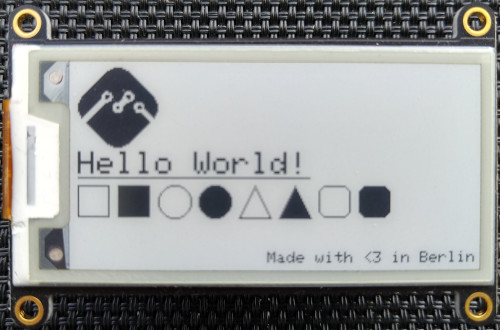

# Hello JavaScript/mJS



## Intro

This example shows how to use the library with JavaScript or rather mJS.

## Prerequisite

Setup [Mongoose OS](https://mongoose-os.com) as described here: https://mongoose-os.com/docs/mongoose-os/quickstart/setup.md

Please note that the chosen configuration is for a [Adafruit HUZZAH32](https://www.adafruit.com/product/3405) and a [(monochrome) ePaper Display FeatherWing](https://www.adafruit.com/product/4195). So please adjust the configuration (config_schema) in [mos.yml](mos.yml) accordingly for your setup.

If you run the example outside the repo, you want to replace the following in [mos.yml](mos.yml)
```
libs:
  - origin: ../../../mgos-arduino-adafruit-epd
```
by
```
libs:
  - origin: https://github.com/bbilger/mgos-arduino-adafruit-epd
```

## Installation

```bash

git checkout https://github.com/bbilger/mgos-arduino-adafruit-epd
cd mgos-arduino-adafruit-epd/examples/hello_c

mos build --clean --local --platform esp32 && mos flash && mos console

```
